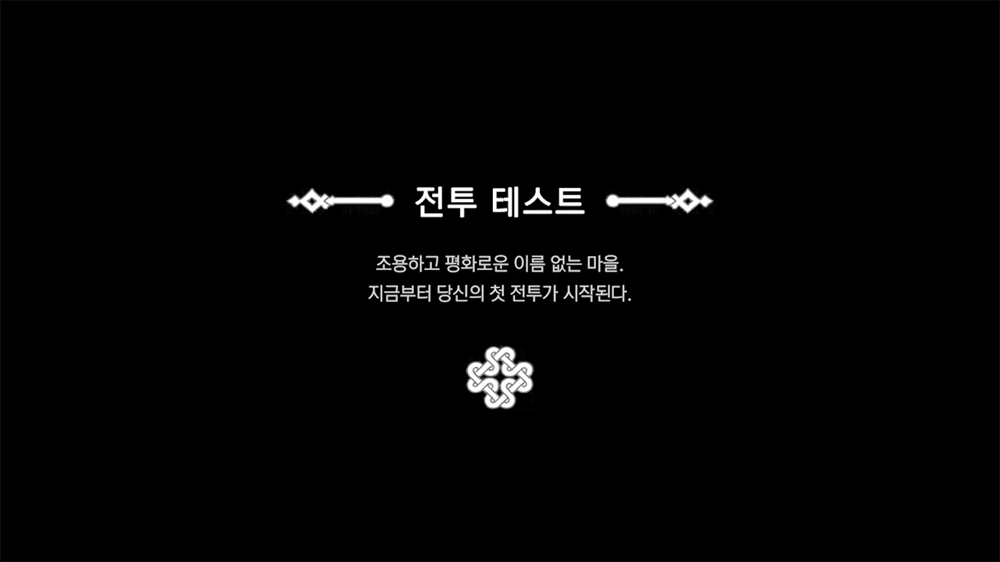
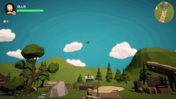
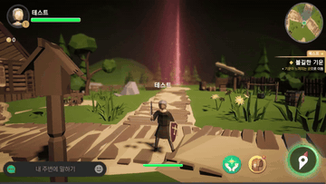
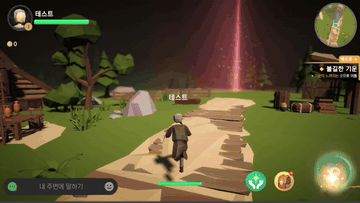
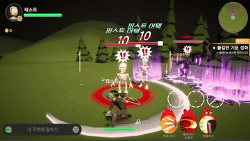
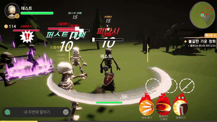
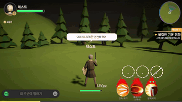

# Unity 모바일 액션 RPG 전투 시스템 프로토타입

**약 2주의 짧은 기간** 동안 모바일 액션 RPG의 **핵심 전투 흐름**을 구현한 Unity 프로토타입입니다. 자동 전투, 콤보, 스킬, 타겟팅, 네비게이션, 서버 검증 모의를 하나의 플레이 흐름으로 연결했습니다.

구현의 중심은 **입력, 이동, 타겟팅, 스킬 실행, 판정, 피드백이 하나의 흐름으로 이어지는 전투 구조**입니다. 전투 상태와 데이터, UI 표시 흐름을 분리해 플레이 가능한 루프 안에서 각 기능이 자연스럽게 연결되도록 구성했습니다.

동시에 **타격감, 발걸음 이펙트, 터치 피드백, 데미지 텍스트, 클리어 프레젠테이션**처럼 전투 경험을 전달하는 시각/청각 피드백도 함께 구성했습니다. 그래픽 리소스는 무료 에셋을 기반으로 사용했으며, **파티클 조합, 머티리얼 세팅, Shader Graph 기반 UI/이펙트 표현, DOTween 연출 타이밍**은 직접 구성·튜닝했습니다.

---

## 프로젝트 한눈에 보기

| 구분 | 내용 |
|---|---|
| 목표 | 짧은 기간 안에 모바일 액션 RPG의 **핵심 전투 흐름**을 플레이 가능한 형태로 검증 |
| 구현 방향 | **입력, 이동, 타겟팅, 스킬, 판정, 피드백**이 하나의 플레이 흐름으로 이어지도록 전투 루프를 구성 |
| 핵심 전투 | **자동 전투**, **콤보 예약 입력**, **스킬 3종(연속 공격, 차지 공격, 스택형 공격)**, **Enemy FSM** |
| 구조 설계 | **FSM 상태 분리**, **ScriptableObject 데이터**, **Object Pool**, **매니저 책임 분리**, **Presenter/View 분리** |
| 이동/네비게이션 | 좌측 터치 이동, 우측 카메라 조작, **NavMesh 기반 자동 이동**, 전투 자동 접근, 정지 처리를 상황별로 분리 |
| 상태 흐름 | 수동 입력, 자동 이동, 자동 전투가 섞이는 상황에서 **입력 우선순위와 상태 전환 흐름**을 처리 |
| 확장 고려 | **ScriptableObject 기반 데이터 구성**, **오브젝트 풀링**, **Mock Network 기반 데미지 승인/이동 스냅샷 보간** |

---

## 게임플레이 데모

> ▶ 아래 썸네일을 클릭하면 YouTube 전체 영상으로 이동합니다.

[](https://www.youtube.com/watch?v=cGqffucLuNc&feature=youtu.be)

전체 영상은 `오프닝 -> 수동 조작 -> 퀘스트 자동 이동 -> 전투 진입 -> 자동 전투/스킬 사용 -> 퀘스트 클리어 -> 구현 항목 요약` 순서로 구성했습니다. 아래 GIF는 각 구간의 핵심 동작만 분리해 정리한 것입니다.

<table>
  <tr>
    <td align="center" width="50%">
      <br>
      <b>1. 오프닝 · 퀘스트 시작</b><br>
      <sub>데모 도입부, 퀘스트 UI 진입, 조작 활성화 흐름</sub>
    </td>
    <td align="center" width="50%">
      <br>
      <b>2. 조이스틱 이동 · 카메라 조작</b><br>
      <sub>수동 이동, 속도 기반 블렌드 트리, 우측 드래그 시점 전환</sub>
    </td>
  </tr>
  <tr>
    <td align="center" width="50%">
      <br>
      <b>3. 네비게이션 이동 · 적 소환</b><br>
      <sub>퀘스트 자동 이동, 카메라 방향 전환, 전투 구역 진입</sub>
    </td>
    <td align="center" width="50%">
      <br>
      <b>4. 콤보 · 스킬 3종 시연</b><br>
      <sub>공격 예약, 연속 공격, 차지 공격, 스택형 공격</sub>
    </td>
  </tr>
  <tr>
    <td align="center" width="50%">
      <br>
      <b>5. 에너미 리스트 · 타겟 전환</b><br>
      <sub>타겟 탐색, 우선순위 갱신, 상황별 대상 전환</sub>
    </td>
    <td align="center" width="50%">
      <br>
      <b>6. 퀘스트 완료 · 구현 항목 요약</b><br>
      <sub>클리어 프레젠테이션, 포트폴리오 요약 카드 표시</sub>
    </td>
  </tr>
</table>


## 프로젝트 정보

| 항목 | 내용 |
|---|---|
| 제작 기간 | 2026.06.16 - 2026.07.02 |
| 엔진 | Unity 6000.3.10f1 |
| 렌더 파이프라인 | Universal Render Pipeline |
| 타겟 | 모바일 조작 환경 |
| 주요 패키지 | DOTween, TextMesh Pro, Unity Input System, NavMesh |

---

## 핵심 구현 10가지

| 구현 항목 | RewardItem 표시 내용 | 구현 방식 |
|---|---|---|
| Auto Combat | 자동 전투 루프 | 적 탐색, 접근 이동, 거리 판단, 공격 실행 흐름을 분리해 관리했습니다. 공격 중 이동 상태가 섞이지 않도록 흐름을 정리했습니다. |
| Attack Queue | 공격 예약 입력/공격 타이밍 조율 | **애니메이션 진행률** 기준으로 **예약 가능 구간**을 두고, **콤보 선입력**을 버퍼링했습니다. 공격 속도 조정 후 체감 대기도 함께 보정했습니다. |
| Skill System | 3가지 타입의 스킬 실행 구조 | **연속 공격, 차지 공격, 스택형 공격**을 공통 실행 흐름에서 처리했습니다. 세부 판정과 연출 참조는 **스킬 데이터**로 분리했습니다. |
| Target Resolver | 대상 탐색/전환 규칙 | **자동 전투, 수동 스킬, 적 리스트 선택** 상황에 따라 현재 타겟을 갱신하고, 공격 가능 거리와 선택 우선순위를 기준으로 대상을 전환하도록 구성했습니다. |
| Navigation System | 미니맵, 이동, 자동 접근, 회전, 정지 | **NavMeshAgent 기반 퀘스트 이동**과 **전투 접근**을 분리했습니다. 카메라 방향, 정지 버튼, 전투 진입 전 감속 흐름을 함께 처리했습니다. |
| Quest System | 퀘스트 상태, 진행, 완료 흐름 | 퀘스트 데이터를 **ScriptableObject**로 관리하고, 처치 수 갱신과 클리어 프레젠테이션을 **이벤트**로 연결했습니다. |
| Enemy FSM | 적 AI 상태 머신 | **대기, 추적, 공격, 피격** 상태를 분리해 이동/공격/피격 행동이 겹치지 않도록 구성했습니다. |
| Object Pooling | 적/VFX/UI 재사용 최적화 | 적, VFX, 데미지 텍스트를 **풀링**해 전투 중 반복 생성/파괴 비용을 줄였습니다. |
| Modular Architecture | 공통 기능 모듈, 매니저 구조 | 자동 전투, 스킬, 콤보, 타겟팅, 네비게이션의 책임을 나누고, 전투 진행·스폰·사운드·풀링처럼 공용으로 쓰이는 흐름은 **매니저 계층**에서 관리했습니다. |
| Data Driven | 데이터 중심/설계 확장 구조 | 스킬, 사운드, VFX, 퀘스트, 다이얼로그, 클리어 요약 항목을 **ScriptableObject**로 관리했습니다. |

---

## 설계 구조

| 구조 | 적용 위치 | 목적 |
|---|---|---|
| FSM | 적 AI, 전투 상태 흐름 | 이동/공격/피격 상태가 서로 침범하지 않도록 상태별 책임을 분리 |
| Responsibility Split | 플레이어 전투 기능 | 자동 전투, 스킬, 콤보, 타겟팅, 네비게이션의 책임을 분리해 전투 흐름을 관리 |
| Data-Driven Design | 스킬, 퀘스트, 다이얼로그, 요약 카드 | 수치와 표시 정보를 코드가 아닌 에셋에서 조정 |
| Presenter/View 분리 | 클리어 팝업, 요약 카드 | 화면 전환 흐름과 개별 UI 바인딩 책임 분리 |
| Object Pool | 적, VFX, 데미지 텍스트 | 반복 생성되는 전투 요소의 비용 절감 |
| Mock Network + Snapshot Interpolation | 데미지 검증과 이동 동기화 모의 | 서버 승인 이후 체력 반영, 지연/드롭 상황 테스트, 스냅샷 버퍼 기반 위치/회전 보간 검토 |

---

## 전투 시스템

전투는 자동 모드 기준으로도 자연스럽게 보이도록 설계했습니다. 자동 전투가 타겟을 찾고 접근한 뒤 공격을 실행하지만, 공격 중 이동 입력이나 스킬 입력이 들어왔을 때 상태가 꼬이지 않도록 **공격 상태, 이동 상태, 차지 상태**를 분리해 관리했습니다.

평타는 **콤보 예약 구간**을 두어 입력감이 끊기지 않도록 했고, 스킬은 서로 다른 **조작 방식과 판정 방식**을 갖도록 구성했습니다.

| 스킬/공격 | 구현 방향 |
|---|---|
| 기본 공격 | 콤보 인덱스와 공격 예약 구간 기반의 연속 공격 |
| 스킬 1 | 연속 공격형 스킬, 전용 VFX 각도와 타격 타이밍 조정 |
| 스킬 2 | 차지형 스킬, 차지 중 이동 제한과 범위 표시, 완료 후 판정 |
| 스킬 3 | 스택형 공격, 누적/소비 흐름을 분리 |

---

## 이동, 타겟팅, 네비게이션

수동 이동은 **가상 조이스틱 입력**을 기준으로 이동 방향과 속도를 계산하고, 이동 속도에 따라 **Animator Blend Tree** 값이 달라지도록 구성했습니다. 걷기/달리기 전환이 끊기지 않도록 입력 크기와 실제 이동 속도를 함께 반영했습니다.

**퀘스트 자동 이동**과 **전투 자동 접근**은 목적이 다르기 때문에 별도 흐름으로 분리했습니다. 자동 이동은 **NavMeshAgent 경로 이동**을 기반으로 처리하고, 수동 이동과 자동 이동 사이의 소유권 전환을 별도 브릿지에서 관리했습니다. **퀘스트 네비게이션**은 목적지까지의 UX가 중요하고, **전투 접근**은 **타겟 거리, 공격 가능 여부, 카메라 방향, 정지 타이밍**이 중요합니다.

전투 구역 스폰은 **NavMesh.SamplePosition**으로 유효 지점을 보정하고, 주변 충돌 검사를 함께 수행해 적이 지형 밖이나 겹친 위치에 생성되지 않도록 구성했습니다.

미니맵은 **월드 좌표 → UI 좌표 변환**으로 플레이어/적 위치를 표시하고, 타겟팅은 **자동 전투 탐색, 수동 스킬 사용, 적 리스트 선택** 상황에 맞춰 현재 대상을 동적으로 갱신하도록 구성했습니다.

---

## 데이터 기반 시스템

**ScriptableObject**를 단순 설정 파일이 아니라 **전투, 연출, 요약 데이터를 교체 가능한 단위**로 사용했습니다.

| 데이터 | 역할 |
|---|---|
| SkillData | 스킬 타입, 데미지, 범위, 히트박스, VFX/Audio 참조 관리 |
| QuestData | 퀘스트 ID, 제목, 설명, 목표 타입, 목표 수치 관리 |
| DialogueData | 오프닝, 구역 진입, 클리어 대사를 ID 기반으로 조회 |
| SoundData | 효과음 ID와 클립 참조 관리 |
| VFXDatabase | 전투/풋스텝/피격 이펙트 참조 관리 |
| RewardSetData | 클리어 화면에 표시할 포트폴리오 요약 항목 묶음 |
| RewardItemData | 요약 카드의 아이콘, 제목, 설명 관리 |

---

## 서버 동기화 고려

실제 서버를 붙인 프로젝트는 아니지만, 전투 로직이 **서버 검증 구조**로 확장될 수 있도록 Mock Network와 위치 동기화 흐름을 분리해 구성했습니다.

스킬 사용 시 클라이언트는 **VFX, 카메라 쉐이크, Hit Stop** 같은 즉시 피드백을 먼저 보여주고, 실제 데미지 반영은 **모의 서버 승인 이후** 처리합니다. 이동은 `PlayerNetworkSyncService`에서 **위치/회전/속도 스냅샷**을 주기적으로 전송하고, `MockNetworkManager`가 지연·드롭·서버 시간을 반영한 승인 스냅샷을 반환하는 구조로 검토했습니다.

수신한 서버 스냅샷은 시간순 **스냅샷 버퍼**에 저장하고, **interpolation back time**만큼 지연 렌더링하여 두 스냅샷 사이의 위치/회전을 보간합니다. 보간 결과와 현재 로컬 위치의 차이는 `ServerPositionError`로 추적하고, 오차 완화를 위해 추가 스무딩을 적용했습니다. 다만 **클라이언트 예측(prediction) 및 위치 보정(reconciliation)**은 이번 범위에서 제외했습니다.

**"전투 감각은 즉시 보여주되, 최종 판정은 서버가 승인한다"** 는 MMORPG 클라이언트 전투 흐름을 포트폴리오 범위 안에서 검토하기 위한 설계입니다. 실서버 재접속, 권위 서버 기반 위치 보정, 패킷 손실 복구까지는 이번 범위에서 제외하고 클라이언트 구조 검증에 집중했습니다.

---

## UI와 프레젠테이션

UI는 단순 표시보다 **상태 전환 흐름**을 중점으로 구현했습니다. 네비게이션 버튼, 전투 버튼, 클리어 팝업은 게임 상태에 따라 타이밍이 다르기 때문에 **DOTween 시퀀스**로 위치와 표시 상태를 제어했습니다.

데미지 텍스트와 알림은 **오브젝트 풀 기반 `FloatingUIManager`** 로 처리해, 전투 중 반복 생성·파괴 없이 **월드 좌표 추적**과 **연출 타이밍**을 함께 관리했습니다.

클리어 팝업은 **포트폴리오 요약 화면**으로 활용했습니다. `RewardSet_PortfolioSummary`에 담긴 10개 항목을 `RewardItemView`에 주입해, 구현한 시스템들을 한 번에 보여주도록 구성했습니다. 일부 UI는 전투 흐름과 영상 전달을 위한 **프레젠테이션 목적**으로 제한 구현했습니다.


---

## 프로젝트 구조

```text
Assets/_Core/Scripts
 ┣ Camera       # 3인칭 카메라, 카메라 입력, 흔들림/시점 제어
 ┣ Core         # FSM, 데미지 인터페이스, 퀘스트 데이터/매니저
 ┣ Data         # ScriptableObject 기반 스킬/사운드/VFX/요약 데이터
 ┣ Enemy        # 적 AI 상태 머신과 적 컨트롤러
 ┣ Managers     # 전투 진행, 스폰, 풀링, 사운드, 게임 흐름 관리
 ┣ Network      # 서버 검증/지연 동기화 모의
 ┣ Player       # 플레이어 이동, 전투, 스킬, 자동 전투, 네비게이션
 ┣ UI           # HUD, 미니맵, 다이얼로그, 적 리스트, 클리어 팝업
 ┗ VFX          # 전투 이펙트 보조 로직
```

---

## 사용 리소스 출처 (Resource Credits)

본 프로젝트는 개인 포트폴리오 기술 검증 목적으로 제작된 비상업적 프로토타입입니다. 마비노기 모바일의 전투 타격감과 사운드 피드백을 주요 레퍼런스로 삼아 작업했으며, 인게임 구현의 시각적/청각적 피드백을 확인하기 위해 활용한 외부 에셋의 출처는 다음과 같습니다.

### 플러그인 & 패키지

| 분류 | 에셋명 | 링크 |
|---|---|---|
| 트윈 애니메이션 | **DOTween (HOTween v2)** by Demigiant | [Asset Store](https://assetstore.unity.com/packages/tools/animation/dotween-hotween-v2-27676) |
| UI 텍스트 | **TextMesh Pro** (Unity 내장) | Unity Package Manager |
| 입력 시스템 | **Unity Input System** (Enhanced Touch) | Unity Package Manager |
| 렌더 파이프라인 | **Universal Render Pipeline (URP)** | Unity Package Manager |

### 3D 모델 & 캐릭터

| 분류 | 에셋명 | 링크 |
|---|---|---|
| 맵 | **RPG Poly Pack - Lite** | [Asset Store](https://assetstore.unity.com/packages/p/rpg-poly-pack-lite-148410) |
| 플레이어 | **PolyPeople Series - MedievalEurope: Peasants [Free]** | [Asset Store](https://assetstore.unity.com/packages/3d/characters/polypeople-series-medievaleurope-peasants-free-337240) |
| 몬스터 | **Stylized Free Skeleton** | [Asset Store](https://assetstore.unity.com/packages/p/stylized-free-skeleton-298650) |
| 무기 | **Free Low Poly Fantasy RPG Weapons** | [Asset Store](https://assetstore.unity.com/packages/p/free-low-poly-fantasy-rpg-weapons-248405) |

### 애니메이션

| 분류 | 에셋명 | 링크 |
|---|---|---|
| 애니메이션 | **Human Melee Animations FREE** | [Asset Store](https://assetstore.unity.com/packages/p/human-melee-animations-free-165785) |
| 애니메이션 | **RPG_Animations_Pack_FREE** | [Asset Store](https://assetstore.unity.com/packages/p/rpg-animations-pack-free-288783) |
| 애니메이션 | **FREE - 32 RPG Animations** | [Asset Store](https://assetstore.unity.com/packages/p/free-32-rpg-animations-215058) |
| 애니메이션 | **Human Basic Motions FREE** | [Asset Store](https://assetstore.unity.com/packages/p/human-basic-motions-free-154271) |

### VFX (Visual Effects)

| 분류 | 에셋명 | 링크 |
|---|---|---|
| 이펙트 | **Magic Effects FREE** | [Asset Store](https://assetstore.unity.com/packages/p/magic-effects-free-247933) |
| 이펙트 | **Free Game VFX Collection(URP)** | [Asset Store](https://assetstore.unity.com/packages/p/free-game-vfx-collection-urp-345212) |
| 이펙트 | **Casual_Hit** | [Asset Store](https://assetstore.unity.com/packages/vfx/particles/casual-hit-318002) |
| 이펙트 | **Simple Stylized Slash Pack 1** | [Asset Store](https://assetstore.unity.com/packages/p/simple-stylized-slash-pack-1-232943) |
| 이펙트 | **Hyper Casual FX** | [Asset Store](https://assetstore.unity.com/packages/p/hyper-casual-fx-200333) |
| 이펙트 | **Stylized Fire - URP** | [Asset Store](https://assetstore.unity.com/packages/p/stylized-fire-urp-355834) |
| 이펙트 | **Vefects - Trails VFX URP** | [Asset Store](https://assetstore.unity.com/publishers/57349) |
| 이펙트 | **Money VFX** | [Asset Store](https://assetstore.unity.com/packages/p/money-vfx-375122) |

### 폰트

| 분류 | 에셋명 | 링크 |
|---|---|---|
| UI 폰트 | **NEXON Lv2 Gothic** | [NEXON Lv2 Gothic](https://brand.nexon.com/ko/ci-brand-guidelines/typeface#section-lv2-gothic) |
| UI 폰트 | **마비옛체 / Mabinogi Classic** | [Mabinogi Classic](https://brand.nexon.com/ko/ci-brand-guidelines/typeface#section-mabinogi-classic) |

### 오디오

| 분류 | 출처 |
|---|---|
| BGM | [낙엽의 춤 (낮 ver.) - Song of the Bard](https://www.youtube.com/watch?v=hsDa0H8PLyE&list=PLrgkfqG7JAcNhwVwHsRbv-fAspDdGNaRd&index=4) (참조 게임 OST / 비상업적 포트폴리오 목적) |
| SFX | 참조 게임 SFX 일부 차용 (발소리, 피격음, 스킬음 등 / 비상업적 포트폴리오 목적) |
